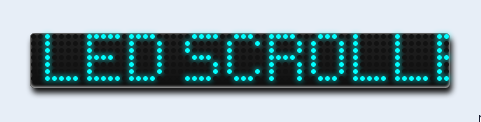

# jeedom_cadres

Vous trouverez ci-dessous la liste des différents cadres pour Jeedom et Nextdom.

## Installation d'un cadre
- Depuis un design, suivez les étapes suivantes :
	- Clic droit, Sélectionnez 'Edition'
	- Clic droit, puis sélectionnez 'Ajouter text/html'
	- Clic droit sur le text/html créé et sélectionnez 'Paramètres d'affichage'
	- Dans la zone 'Texte', collez le contenu du fichier du cadre
	- Parcourir le contenu du texte et modifiez le paramétrage pour chaque cadre en fonction de vos choix de configuration (à partir de la ligne // *** Paramètres à modifier ***********)
	
## Liste des cadres

### Cadre Led Scroller : à récupérer sous /jeedom_cadres/ledScroller/index.html

	- voir la suite de l'installation (paramétrage spécifique dans le readme de /ledScroller)

	