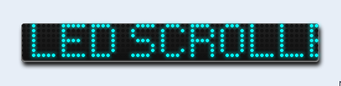
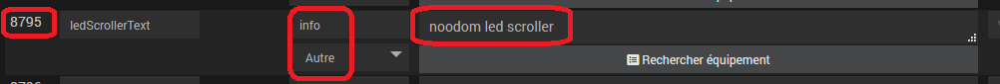
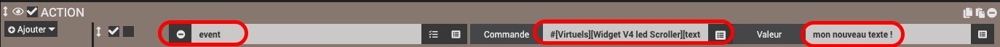

# Cadre led Scroller

## Installation du cadre

Attention : un seul cadre par design pour un bon fonctionnement

- Depuis un design, suivez les étapes suivantes :
	- Clic droit, Sélectionnez 'Edition'
	- Clic droit, puis sélectionnez 'Ajouter text/html'
	- Clic droit sur le text/html créé et sélectionnez 'Paramètres d'affichage'
	- Dans la zone 'Texte', collez le contenu du fichier du cadre à récupérer sous /jeedom_cadres/ledScroller/index.html
	- Parcourir le contenu du texte et modifiez le paramétrage pour chaque cadre en fonction de vos choix de configuration (à partir de la ligne // *** Paramètres à modifier ***********)
	
	
## Paramétrage du cadre

		- Récupérer l'id de la commande info contenant le texte à faire défiler

		- Paramètres à modifier au niveau de // *** Paramètres à modifier ***********
			- cmdId : /!\ IMPORTANT A MODIFIER ABSOLUMENT : Id d'une commande info existante contenant le texte à afficher
			- ledColor : Couleur des leds allumées (texte)
			- marqueeBackgroundColor : Couleur des leds éteintes (fond)
	
			- Le texte de la commande info peut contenir les caractères suivants :
				ABCDEFGHIJKLMNOPQRSTUVWXYZ1234567890°#|'€"/%-*+=?!:,.
			- Ce champ texte peut être modifié par scénario avec la commande event : 
				la mise à jour du texte sera alors immédiate sur le design

